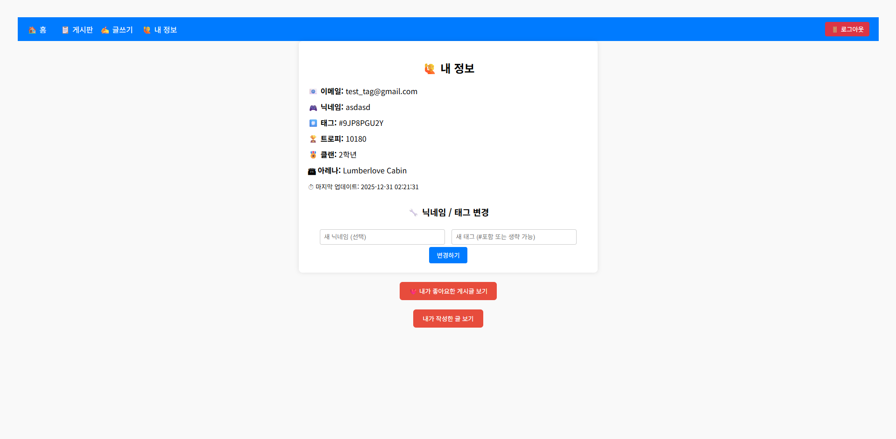
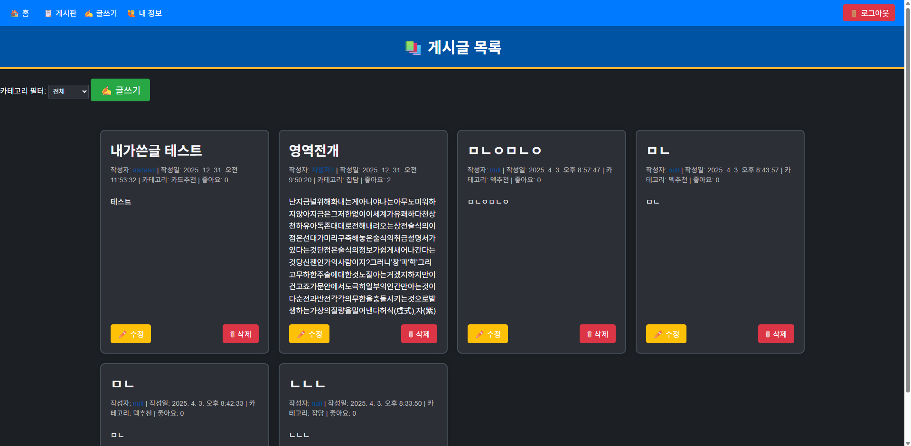
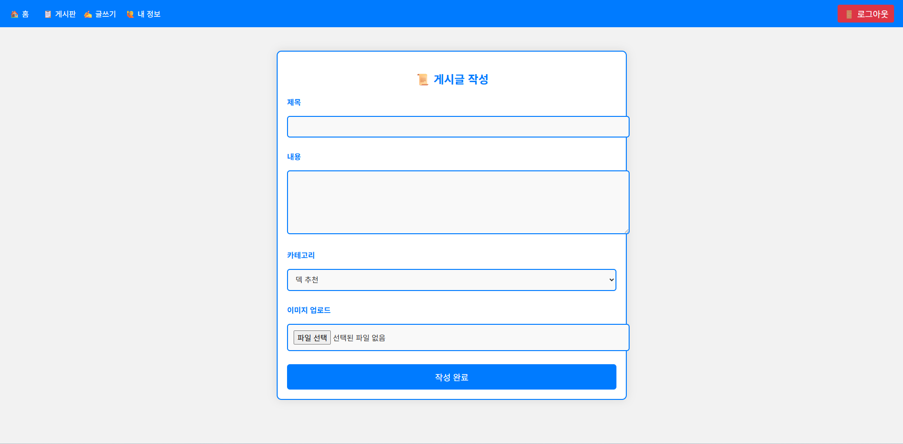

# 📱 Clash Royale 커뮤니티 프로젝트

> 클래시로얄 유저 정보를 기반으로 커뮤니티 기능을 구현한 웹 프로젝트입니다.

---

## 🔧 주요 기능

- 📝 게시판 CRUD (글쓰기, 수정, 삭제, 목록)
- 👥 회원가입 / 로그인 (JWT 인증)
- 🏆 Clash Royale API 연동을 통한 사용자 태그/트로피/클랜/아레나 정보 업데이트
- ❤️ 좋아요 기능 및 내가 좋아요한 게시글 목록 조회
- 🔒 프로필 공개 여부 설정 기능 (is_public)
- 🔍 다른 유저 프로필 조회 (공개된 경우)

---

## 📦 기술 스택

| 영역 | 기술 |
|------|------|
| 프론트엔드 | HTML, CSS, JS (Vanilla) |
| 백엔드 | Node.js, Express |
| DB | SQLite3 |
| 인증 | JWT (jsonwebtoken) |
| API 연동 | Clash Royale Official API |

---

## 🔐 .env 환경변수 설정

```env
JWT_SECRET=your_jwt_secret_here
CLASH_API_TOKEN=your_clash_api_token_here
```

---

## 📁 디렉토리 구조

```
clashroyale_community/
├── server.js
├── auth.js
├── article_controller.js
├── comment_controller.js
├── player_controller.js
├── public/
├── index.html
├── profile.html
├── liked-posts.html
├── ...
├── uploads/
│   ├── profile-view.png
│   ├── article-list.png
│   └── liked-posts.png
├── clash_community.db
└── screenshots/
```

---

## 🧪 SQLite 쿼리 예시

- 좋아요한 게시글 확인
```sql
SELECT a.id, a.title, a.content, a.likes, a.created_at, ut.nickname
FROM likes l
JOIN articles a ON l.article_id = a.id
JOIN users u ON a.user_id = u.id
JOIN users_tag ut ON u.id = ut.user_id
WHERE l.user_id = ?;
```

- 특정 유저 정보 확인
```sql
SELECT * FROM users_tag WHERE user_id = ?;
```

---

## 🎨 UI 디자인 미리보기

> 실제 구현된 페이지의 디자인을 미리 볼 수 있습니다.

### 🧑‍💼 프로필 조회 화면


### 📝 게시글 목록


### ✍️ 게시글 작성성


---

## 📌 참고

- Clash Royale API: https://developer.clashroyale.com
- DB 파일: `clash_community.db`
- 프론트엔드는 정적 HTML + JS로 구성됨 (리액트 아님)

---

## ✍️ 작성자

- GitHub: [skgma1019](https://github.com/skgma1019)
- 특성화고 진학 후 포트폴리오용 프로젝트로 제작
